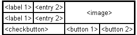

> Grid(网格)布局管理器会将控件放置到一个二维的表格里。
>
> 主控件被分割成一系列的行和列，表格中的每个单元(cell)都可以放置一个控件。

**什么时候使用 Grid 管理器**

grid 管理器是 Tkinter 里面最灵活的几何管理布局器。如果你不确定什么情况下从三种布局管理中选择，你至少要保证自己会使用 grid。

参考下面这个例子：

使用 pack 进行布局的话，你不得不使用一些额外的 frame 控件，而且还需要花费一些功夫让他们变得好看。如果你使用 grid 的话，你只需要对每个控件使用 grid,所有的东西都会以合适的方式显示。

**注意：不要试图在一个主窗口中混合使用 pack 和 grid。**

使用 grid 进行布局管理非常容易。只需要创建控件，然后使用 grid 方法去告诉布局管理器在合适的行和列去显示它们。你不用事先指定每个网格的大小，布局管理器会自动根据里面的控件进行调节。

label“账号”占据 0 行 0 列
label“密码”占据 1 行 0 列
entry”账号“输入框占据 0 行 1 列
entry“密码”输入框占据 1 行 1 列
button”登陆“占据 0-1 行 2 列

你同样可以指定控件跨越一个或者多个网格。columnspan 选项可以指定控件跨越多列显示，而 rowspan 选项同样可以指定控件跨越多行显示。

在这段代码中，有一些细节需要注意：

1.  我们没有为左边的两个 label 控件指定具体的位置，在这种情况下，column 将会从 0 开始，而 row 将会从第一个没有使用的值开始。

2.  我们队 checkbutton 设置了 columnspan 参数，所以它会显示在第二行，并占据第 0 和 1 列。

3.  图像 label 占用了 2 行 2 列，而最后的两个 button 都只占用了 1 列。
